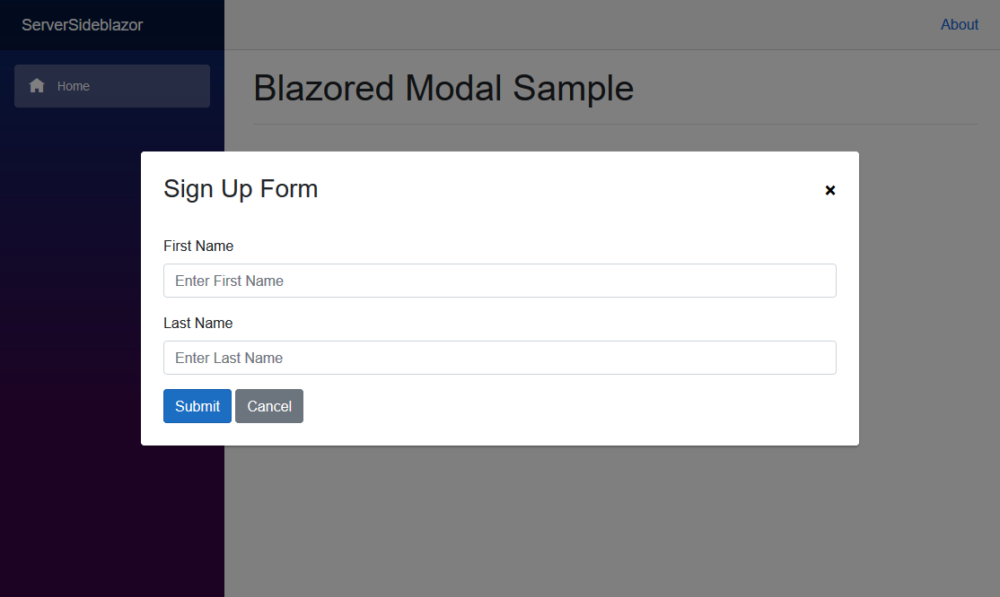
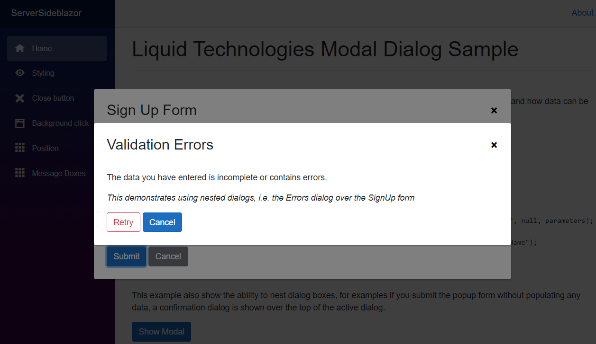
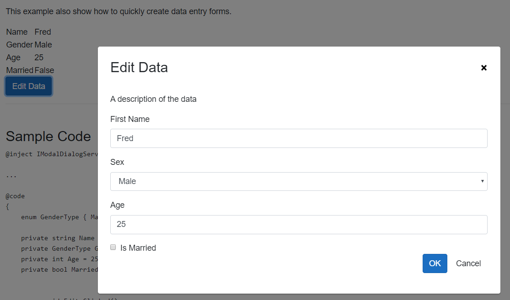

# Liquid Technologies Modal Dialogs for Blazor

A simple and customizable Modal Dialog and MessageBox implementation for [Blazor](https://blazor.net)



## Summary
* Simple way to turn a Blazor Component into a Modal Dialog.
* Data can be passed to the Modal Dialog Blazor Component
* Allows values returned from the Modal Dialog Blazor Component to be retrieved.
* Can be used in functions without breaking up the flow of the logic i.e.
```    
    ModalDialogResult result = await ModalDialog.ShowDialogAsync<ConfirmationForm>("Are You Sure");
    if (result.Success)
        DeleteEverything();
```
* Can be nested. i.e. a Modal Dialog can create child Modal Dialogs.
* Includes Simple Windows style MessageBox's
 


## Credits

This is a re-work of Chris Sainty's [Blazored.Modal](https://github.com/Blazored/Modal), it builds on the work he has done, but because the approach is quite different and the API is not compatible, I chose to re-package this as a separate project. All namespaces and CSS styles names have been altered to avoid clashes.


## Getting Setup

You can install the package via the nuget package manager just search for *LiquidTechnologies.Blazor.ModalDialog*. You can also install via powershell using the following command.

```powershell
Install-Package LiquidTechnologies.Blazor.ModalDialog
```

Or via the dotnet CLI.

```bash
dotnet add package LiquidTechnologies.Blazor.ModalDialog
```

### 1. Register Services

You will need to add the following using statement and add a call to register the Blazored Modal services in your applications `Startup.ConfigureServices` method.

```csharp
using LiquidTechnologies.Blazor.ModalDialog;

public void ConfigureServices(IServiceCollection services)
{
    services.AddModalDialog();
}
```

### 2. Add Imports

Add the following to your *_Imports.razor*

```csharp
@using LiquidTechnologies.Blazor.ModalDialog
@using LiquidTechnologies.Blazor.ModalDialog.Services
```

### 3. Add Modal Component

Add the `<ModalDialogContainer />` tag into your applications *MainLayout.razor*.

### 4. Add reference to style sheet

Add the following line to the `head` tag of your `_Host.cshtml` (Blazor Server app).

```html
<link href="_content/LiquidTechnologies.Blazor.ModalDialog/liquid-modal-dialog.css" rel="stylesheet" />
```

## Usage

### Showing a Dialog and getting the return value

In order to show the modal, you have to inject the `IModalDialogService` into the component or service you want to invoke the modal. 
You can then call the `ShowDialogAsync` method passing in the title for the modal and the type of the component you want the modal to display.

For example, say I have a component called `SignUpForm` which will request the users first and last name.

Once the user has completed the form a ModalDialogResult object is returned with the result.
The data the user submitted in the form can then be read and used (or ignored if the form was cancelled).

```html
@page "/"
@inject IModalDialogService Modal

<button @onclick="SignUpBtn_Clicked" class="btn btn-primary">Sign Up Now</button>

@code {
    async void SignUpBtn_Clicked()
    {
        ModalDialogResult result = await ModalDialog.ShowDialogAsync<SignUpForm>("Sign Up For your free account");
        if (result.Success)
            CreateNewUser(result.ReturnParameters.Get<string>("FirstName"), result.ReturnParameters.Get<string>("LastName"))
    }
}
```
**Note** *the function `SignUpBtn_Clicked` is `async`. The Task<ModalDialogResult> returned from `ModalDialog.ShowDialogAsync` is only completed when the SignUpForm has been closed, allowing the code to make use of the return values from the Modal Dialog.*

### Passing Arguments to a Dialog

If you need to pass values to the component you are displaying in the modal dialog, then you can use the `ModalDialogParameters` object. 
Any component which is displayed in the modal has access to this object as a `[CascadingParameter]`.

```html
@page "/"
@inject IModalDialogService Modal

<h1>My Movies</h1>

<ul>
    @foreach (var movie in Movies)
    {
        <li>@movie.Name (@movie.Year) - <button @onclick="@(async () => await ShowEditMovie(movie.Id))" class="btn btn-primary">Edit Movie</button></li>
    }
</ul>

@code {

    List<Movies> Movies { get; set; }

    async void ShowEditMovie(int movieId)
    {
        ModalDialogParameters parameters = new ModalDialogParameters();
        parameters.Add("MovieId", movieId);

        Movie editedMovie = await ModalDialog.ShowDialogAsync<EditMovie>("Edit Movie", new ModalDialogOptions(), parameters);
    }
}
```

### Options

```html
@inject IMovieService MovieService
@inject IModalDialogService Modal

<div class="simple-form">

    <div class="form-group">
        <label for="movie-name">Movie Name</label>
        <input @bind="@Movie.Name" type="text" class="form-control" id="movie-name" />
    </div>

    <div class="form-group">
        <label for="year">Year</label>
        <input @bind="@Movie.Year" type="text" class="form-control" id="year" />
    </div>

    <button @onclick="@SaveMovie" class="btn btn-primary">Submit</button>
    <button @onclick="@Cancel" class="btn btn-secondary">Cancel</button>
</div>

@code {

    [CascadingParameter] ModalDialogParameters Parameters { get; set; }

    int MovieId { get; set; }
    Movie Movie { get; set; }

    protected override void OnInit()
    {
        MovieId = Parameters.Get<int>("MovieId");
        LoadMovie(MovieId);
    }

    void LoadMovie(int movieId)
    {
        Movie = MovieService.Load(movieId);
    }

    void SaveMovie()
    {
        MovieService.Save(Movie);

        ModalDialogParameters returnParameters = new ModalDialogParameters();
        returnParameters.Add("Movie", Movie);
        Modal.Close(true, returnParameters);
    }

    void Cancel()
    {
        Modal.Close(false);
    }
}
```

### Options

The modal dialogs can be customized to fit a wide variety of uses. These options can be set using the `ModalDialogOptions` object passed into `ShowDialogAsync`.

#### Hiding the close button

A modal has a close button in the top right hand corner by default. 

```csharp
@code {
    void ShowModal()
    {
        ModalDialogOptions options = new ModalDialogOptions()
        {
            ShowCloseButton = false
        };

        await ModalDialog.ShowDialogAsync<Movies>("My Movies", options);
    }
}
```

#### Disabling background click cancellation

You can disable cancelling the modal by clicking on the background using the `BackgroundClickToClose` parameter.

```csharp
@code {
    void ShowModal()
    {
        ModalDialogOptions options = new ModalDialogOptions()
        {
            BackgroundClickToClose = false
        };

        await ModalDialog.ShowDialogAsync<Movies>("My Movies", options);
    }
}
```

#### Styling the modal

You can set an alternative CSS style for the modal if you want to customize the look and feel. 
This is useful when your web application requires different kinds of modal dialogs, like a warning, confirmation or an input form.

```csharp
@code {
    void ShowModal()
    {
        ModalDialogOptions options = new ModalDialogOptions()
        {
            Style = "acme-modal-dialog-movies"
        };

        await ModalDialog.ShowDialogAsync<Movies>("My Movies", options);
    }
}
```

#### Setting the position

Modal Dialogs are shown in the center of the viewport by default. The modal can be shown in different positions if needed. The positioning is flexible as it is set using CSS styling.

The following positioning styles are available out of the box: `liquid-modal-dialog-center`, `liquid-modal-dialog-topleft`, `liquid-modal-dialog-topright`, `liquid-modal-dialog-bottomleft` and `liquid-modal-dialog-bottomright`. Definitions of these styles are found in `ModalDialogPositionOptions`.


```csharp
@code {
    void ShowModal()
    {
        ModalDialogOptions options = new ModalDialogOptions()
        {
            Position = ModalDialogPositionOptions.TopLeft
        };

        await ModalDialog.ShowDialogAsync<Movies>("My Movies", options);
    }
}
```

### Error Handling

```csharp
// Opeing the Dialog
try
{
    ModalDialogResult result = await ModalDialog.ShowDialogAsync<SignUpForm>("Sign Up Form");
    if (result.Success)
        Message = "New User Created : " + result.ReturnParameters.Get<int>("UserID");
}
catch(Exception ex)
{
    // Handle Exception thrown from ShowDialogAsync
}

...

// In the Blazor Component
async void Ok_Clicked()
{
    try
    {
        int newUserID = CreateUser(FirstName, LastName);

        ModalDialogParameters resultParameters = new ModalDialogParameters();
        resultParameters.Set("UserID", newUserID);
        ModalDialogService.Close(true, resultParameters);
    }
    catch (Exception ex)
    {
        // pass the exception back to the ShowDialogAsync call that opened the Dialog
        ModalDialogService.Close(ex);
    }
}

```

### Nested Modal Dialogs

When a Modal Dialog is displayed it is possible to display another Modal Dialog over the top. there is no limit to the number of dialogs that can be displayed in this way (MessageBoxes can also be used while Modal Dialogs are shown).



### MessageBoxes

For convenience a set of Windows style Message Box's can be created using the `ShowMessageBoxAsync` method. These work in the same ways as the standard Windows MessageBox (except it doesn't have an icon). 

`Task<MessageBoxDialogResult> IModalDialogService.ShowMessageBoxAsync(string title, string message, MessageBoxButtons buttons = MessageBoxButtons.OK, MessageBoxDefaultButton defaultButton = MessageBoxDefaultButton.Button1)`

They can be used as 

```csharp
async void DeleteAllFilesButton_Clicked()
{
    MessageBoxDialogResult result = await ModalDialog.ShowMessageBoxAsync("Confirm Delete", "Are you sure you want to delete all the files?", MessageBoxButtons.YesNo, MessageBoxDefaultButton.Button2);
    if (result == MessageBoxDialogResult.No)
        return;

    DeleteAllFiles();
}
```


### Simple Data Input Form

The ModalDataInputForm makes it possible to construct simple data input forms for capturing and editing
basic information without the need to create a specific razor component to handle it.

Simply create a ModalDataInputForm instance, and add the fields you need to it. Then call ShowAsync, 
when the user submits the form the data is returned in the fields you just created.



#### Features
* Field Type Support
   * String
   * Integer
   * Boolean
   * Enumerations
* Field properties
   * custom validation function
   * min/max length
   * min/max value
   * auto trucate
   * auto trim
   * custom validation function
* Validation
  * Field level
  * Cross Field validation

#### Sample Code

```csharp

@@inject IModalDialogService ModalService

...

@@code 
{
    enum GenderType { Male, Female }

    private string Name = "Fred";
    private GenderType Gender = GenderType.Male;
    private int Age = 25;
    private bool Married = false;


    async void Edit_Clicked()
    {
        ModalDataInputForm frm = new ModalDataInputForm("Edit Data", "A description of the data");

        var nameFld = frm.AddStringField("Name", "First Name", this.Name, "the users first name");
        var genderFld = frm.AddEnumField<GenderType>("Gender", "Sex", this.Gender, "the users gender");
        var ageFld = frm.AddIntField("Age", "Age", this.Age, "the age of the user", min:0, max:130);
        var marriedFld = frm.AddBoolField("Married", "Is Married", this.Married, "is the user married");

        if (await frm.ShowAsync(ModalService))
        {
            this.Name = nameFld.Value;
            this.Gender = genderFld.Value;
            this.Age = ageFld.Value;
            this.Married = marriedFld.Value;
            StateHasChanged();
        }
    }
}
```